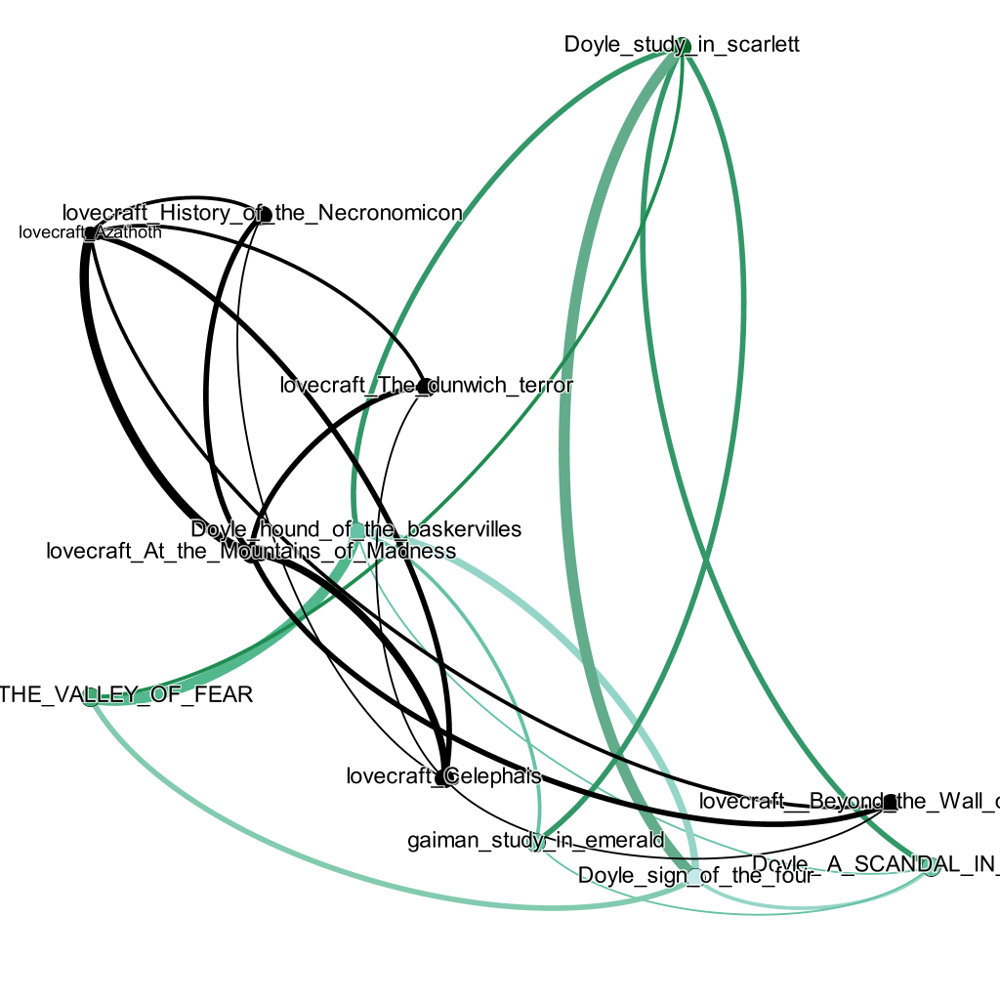

# digital-literacy
<h1 style="font-size:500%;">Лавкрафт против Конан Дойла</h1>

 VS 

 Рассказ Нила Геймана "Этюд в изумрудных тонах" повествует о приключениях Шерлока Холмса в мире, где правят лавкрафтовские чудовища. В частности, у королевы Виктории есть щупальца, и она правит уже более 800 лет. Мне стало иинтересно, чего же больше в этом рассказе - уюта Бейкер-стрит или мрачной изнанки этой хтонической реальности?
 

 Для лемматизации я использовала библиотеку spaCy, а потом загрузила результаты в stylo. Я ожидала, что рассказ Геймана будет посередине между Лавкрафтом и Конан Дойлом, а из рассказов Конан Дойла будет ближе всего к другому "Этюду". Но результаты оказались совсем другими: от Лавкрафта Гейман почти не заимствовал стиль, а из рассказов Конан Дойла он оказался ближе всего к "Скандалу в Богемии" 

